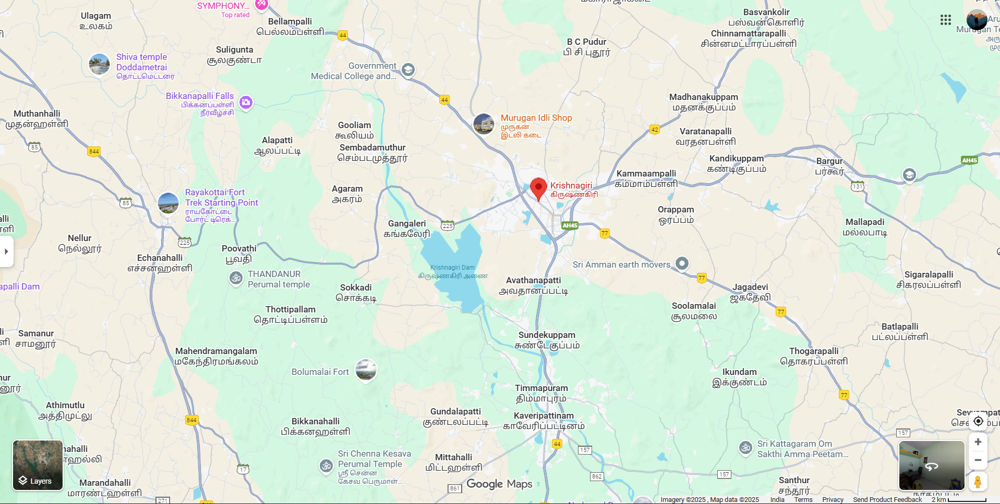

# Ex04 Places Around Me
## Date: 10/12/2025
## REF:25015594
## AIM
To develop a website to display details about the places around my house.

## DESIGN STEPS

### STEP 1
Create a Django admin interface.

### STEP 2
Download your city map from Google.

### STEP 3
Using ```<map>``` tag name the map.

### STEP 4
Create clickable regions in the image using ```<area>``` tag.

### STEP 5
Write HTML programs for all the regions identified.

### STEP 6
Execute the programs and publish them.

## CODE
~~~
map.html

<html>
<head>
<title>My City</title>
</head>
<body>
<h1 align="center">
<font color="blue"><b>KRISHNAGIRI</b></font>
</h1>
<h3 align="center">
<font color="orange"><b>K.ASHWINNEHREJ (25015594)</b></font>
</h3>
<center>

<map name="image-map">
    

<map name="image-map">
    <area target="" alt="Govt Medical college" title="Govt Medical college" href="college.html" coords="823,149,699,114" shape="rect">
    <area target="" alt="Pikkanapalli falls" title="Pikkanapalli falls" href="falls.html" coords="467,194,92" shape="circle">
    <area target="" alt="KRP dam" title="KRP dam" href="dam.html" coords="868,517,97" shape="circle">
    <area target="" alt="Perumal temple" title="Perumal temple" href="temple.html" coords="518,506,405,555" shape="rect">
    <area target="" alt="Krishnagiri Fort" title="Krishnagiri Fort" href="fort.html" coords="317,398,100" shape="circle">
</map>
</center>
</body>
</html>
~~~
~~~
college.html
<html>
    <head>
        <title>
            govt college 
        </title>
    </head>
    <body>
        <h1>GOVT MEDICAL COLLEGE

        </h1>
        <h3>krishnagiri

        </h3>
        <p>
            Government Medical College & Hospital, Krishnagiri, established in 2021 at Polupalli, is a major medical education and healthcare institution in Krishnagiri district. Affiliated with Tamil Nadu Dr. M.G.R. Medical University and approved by the NMC, the college offers 150 MBBS seats each year and provides modern training through its well-equipped classrooms, laboratories, and teaching hospital. Located along NH-48 near the foothills of Melumalai, the campus has a calm environment while remaining easily accessible. The attached multi-specialty hospital delivers 24/7 medical services including emergency care, surgery, orthopaedics, and general medicine, serving thousands of people in and around the district. With its combination of academic excellence and strong healthcare facilities, GMCH Krishnagiri plays a crucial role in improving medical access and producing skilled healthcare professionals for the region.
        </p>
    </body>
</html>
~~~
~~~
dam.html
<html>
    <head>
        <title>
            Krp Dam
        </title>
    </head>
    <body>
        <h1>KRP DAM
        
        </h1>
        <h3>Krishnagiri

        </h3>
        <p>
            The Krishnagiri Reservoir Project (KRP) Dam, built across the Thenpennai (South Pennar) River near Dhuduganahalli in Krishnagiri district, Tamil Nadu, is a major irrigation and water-supply structure completed in 1957 during the Kamaraj era. Stretching nearly one kilometre in length, the dam was designed to store over 68 million cubic metres of water, which supports the irrigation of thousands of acres of farmland in and around Krishnagiri and also provides drinking water to nearby towns and villages. With its spillway gates, scenic reservoir, and the popular KRP Dam Park adjoining it, the dam serves both practical and recreational purposes, making it an essential landmark for the region’s agriculture, water management, and tourism.
        </p>
    </body>
</html>
~~~
~~~
falls.html
<html>
    <head>
        <title>
            pikkanapalli falls
        </title>
    </head>
    <body>
        <h1>PIKKANAPALLI FALLS

        </h1>
        <h3>krishnagiri

        </h3>
        <p>
            Pikkanapalli (Bikkanapalli) Falls in Krishnagiri is a small but scenic natural waterfall located near Bikkanapalli village, surrounded by rocky hills, greenery, and a peaceful rural atmosphere. It is not a commercial tourist spot, which makes it a quiet place for nature lovers who enjoy short treks, photography, and spending time away from crowds. Water flow is usually seasonal, becoming fuller during the monsoon months, and visitors often appreciate the calm environment and natural beauty. However, the approach roads can be rough, and the water may sometimes get muddy during rains, so travellers are advised to visit with caution. Overall, Pikkanapalli Falls is a simple, serene getaway for those looking to explore Krishnagiri’s lesser-known natural spots.
        </p>
    </body>
</html>
~~~
~~~
fort.html
<html>
    <head>
        <title>
            krishnagiri fort
        </title>
    </head>
    <body >
        <h1>KRISHNAGIRI FORT

        </h1>
        <h3>krishnagiri

        </h3>
        <p>
            Krishnagiri Fort, perched atop a rocky hill in Krishnagiri district of Tamil Nadu, is a historic fortress that has stood guard over the region for centuries. Built on a prominent hillock, the fort commands panoramic views of the surrounding landscape — rolling hills, plains, and, on a clear day, even distant townships — making it both strategically valuable in the past and scenically appealing for today’s visitors. Though time and wear have weathered much of its original grandeur, the ruins of old walls and foundations still evoke the fort’s earlier importance and give a sense of the historic legacy of local rulers and kingdoms. Many who visit the fort appreciate its quiet, elevated ambiance as well as the opportunity to explore old stonework and enjoy a peaceful climb, making it a modest but meaningful heritage-site for history lovers, pilgrims, and tourists alike.
        </p>
    </body>
</html>
~~~
~~~
temple.html
<html>
    <head>
        <title>
            perumal temple
        </title>
    </head>
    <body>
        <h1>PERUMAL TEMPLE

        </h1>
        <h3>krishnagiri

        </h3>
        <p>
            The Krishnagiri Perumal Temple, also known as the Kalinga Narthana Perumal Temple, is a well-known and ancient Hindu temple dedicated to Lord Vishnu, located near the Krishnagiri Fort and close to the town’s central area. The temple is admired for its serene atmosphere, traditional Dravidian architectural style, and beautifully carved mandapams. The main deity, Lord Perumal, is worshipped in a graceful standing posture, and devotees believe the temple brings peace, prosperity, and protection. Situated on a small hillock, the temple offers a calm spiritual setting with views of the surrounding town and hills, making it both a devotional and scenic destination for visitors and pilgrims throughout the year.
        </p>
    </body>
</html>
~~~
## OUTPUT
#map.html

#college.html

#dam.html

#falls.html

#fort.html

#temple.html


## RESULT
The program for implementing image maps using HTML is executed successfully.
